# Tietomalli

Tämä on luonnos, ei skeema. Nimet ja kentät ovat siinä muodossa, joka tekee
ajattelusta tarkkaa, ei siinä muodossa jossa ne menevät migraatioon.

## Peruslähtökohta

**Festivaali ei ole iso tapahtuma. Se on monta pientä tapahtumaa, jotka jakavat infran.**

Siksi perusyksikkö ei ole "tapahtuma" vaan kolme tasoa:

- **Tuotanto** on sopimus, tilaaja ja raha.
- **Paikka** on tekninen ympäristö: rigi, patch, virta, kasausikkuna, vuorot.
- **Slot** on yksittäinen esitys tai puhe: rider, vaihto, soundcheck.

Tunnin tilaisuus on yksi tuotanto, yksi paikka, yksi slot.
Viikon festivaali on yksi tuotanto, kuusi paikkaa ja neljäsataa slottia.

Kolmiportaisuus on **aina** olemassa tietomallissa. Se, näkyykö se käyttöliittymässä,
on erillinen kysymys, ja vastaus on kohdassa "Sääntö 5".

## Suhteet

```mermaid
erDiagram
    TUOTANTO ||--o{ PAIKKA : sisaltaa
    TUOTANTO ||--o{ OSAPUOLI : sisaltaa
    TUOTANTO ||--o{ MUUTOS : sisaltaa
    TUOTANTO ||--o{ PAATOSKOHTA : sisaltaa
    TUOTANTO ||--o{ VERSIO : sisaltaa
    PAIKKA ||--o{ SLOT : sisaltaa
    SLOT }o--o| OSAPUOLI : vastapuoli
    TARVE }o--|| RESURSSI : toteutuu
    RESURSSI ||--o{ VARAUS : varataan
    OSAPUOLI ||--o{ PAASY : saa
    OSAPUOLI ||--o{ MUUTOS : ehdottaa
    TOIMITETTAVA }o--|| OSAPUOLI : omistaa
    LAHDE_DOKUMENTTI ||--o{ TARVE : synnyttaa
    LAHDE_DOKUMENTTI ||--o{ MUUTOS : synnyttaa
    LAHDE_DOKUMENTTI ||--o| LAHDE_DOKUMENTTI : edellinen_versio
    TOIMITETTAVA ||--o{ MERKINTA : sisaltaa
    VERSIO ||--o{ TULOSTE : ladataan
```

`TARVE`, `VARAUS`, `PAASY` ja `TOIMITETTAVA` kiinnittyvät polymorfisesti mihin tahansa
kolmesta tasosta (`kohde_tyyppi` + `kohde_id`). Se on tarkoituksellista: sama LED-seinä
voi olla paikan pysyvä varuste tai yhden slotin erikoisvaatimus, ja sama tiedostopaikka
voi olla koko tuotannon pohjakuva tai yhden artistin backline-lista.

## Entiteetit

### tuotanto

| Kenttä | Tyyppi | Huomio |
| --- | --- | --- |
| `id` | uuid | |
| `nimi` | text | |
| `tilaaja_org` | text | |
| `tila` | enum | luonnos, tarjottu, vahvistettu, ajettu, laskutettu |
| `alkaa`, `paattyy` | timestamptz | Koko tuotannon kaari, ei ohjelman |
| `aikavyohyke` | text | Kiinnitetään tuotantoon, ei käyttäjään |

### paikka

| Kenttä | Tyyppi | Huomio |
| --- | --- | --- |
| `id` | uuid | |
| `tuotanto_id` | uuid | |
| `nimi` | text | "Pääsali", "Lava 2" |
| `osoite` | text | |
| `kasaus_alkaa`, `kasaus_paattyy` | timestamptz | Kasausikkuna |
| `purku_alkaa`, `purku_paattyy` | timestamptz | |

### slot

| Kenttä | Tyyppi | Huomio |
| --- | --- | --- |
| `id` | uuid | |
| `paikka_id` | uuid | |
| `nimi` | text | |
| `tyyppi` | enum | esitys, puhe, vaihto, tauko, tekninen |
| `alkaa` | timestamptz | |
| `kesto` | interval | |
| `vastapuoli_id` | uuid, null | Artisti tai puhuja osapuolena |
| `nakyy_asiakkaalle` | bool | Näkyykö rivi asiakasrenderöinnissä |

`nakyy_asiakkaalle` on kenttä eikä suunnittelijan kertapäätös. Oletusarvo tulee
slotin tyypistä: `tekninen` piiloon, muut näkyviin. Tuottaja voi kääntää sen
riveittäin, jolloin periaate "kaksi näkymää samaan dataan" on muokattavissa
tuotantokohtaisesti.

Vaihdot ja soundcheckit ovat slotteja siinä missä esityksetkin. Muuten aikataulun
riippuvuuslaskenta joutuu keksimään ne joka kerta uudestaan.

### tarve

Tämän mallin tärkein taulu. Kaikki mitä tapahtuma vaatii, kaikilla kolmella tasolla.

| Kenttä | Tyyppi | Huomio |
| --- | --- | --- |
| `id` | uuid | |
| `kohde_tyyppi`, `kohde_id` | enum, uuid | tuotanto, paikka tai slot |
| `kategoria` | enum | aani, valo, video, virta, rigi, henkilosto, kuljetus |
| `kuvaus` | text | |
| `maara`, `yksikko` | numeric, text | |
| `tila` | enum | **ehdotettu**, vahvistettu, hylatty |
| `lahde_tyyppi` | enum | brief, rider, viesti, manuaalinen |
| `lahde_id` | uuid | Viittaus alkuperäiseen dokumenttiin tai viestiin |
| `lahde_lainaus` | text | **Se lause, josta tämä rivi syntyi** |
| `luoja` | enum | ihminen, malli |

`lahde_lainaus` on se kenttä, joka tekee tekoälystä käyttökelpoisen tässä alassa.
Ilman sitä käyttäjä joutuu luottamaan. Sen kanssa hän voi tarkistaa.

### resurssi ja varaus

`resurssi`: kalusto tai henkilö. `id`, `tyyppi`, `nimi`, `yksikkohinta`,
`lahde` (oma, alihankinta).

`varaus`: `resurssi_id`, `kohde_tyyppi`, `kohde_id`, `alkaa`, `paattyy`, `maara`.

Kalustorekisteri ei ole tämän tuotteen ongelma. Resurssitaulu on riittävä paikallinen
esitys, ja oikea kalustokanta tulee integraationa. Katso avoimet kysymykset.

### osapuoli

| Kenttä | Tyyppi | Huomio |
| --- | --- | --- |
| `id` | uuid | |
| `tuotanto_id` | uuid | Osapuoli on aina tuotantokohtainen |
| `nimi`, `sahkoposti`, `organisaatio` | text | |
| `luokka` | enum | tilaaja, vastapuoli, oma_tiimi, alihankkija |
| `mandaatti_katto` | numeric, null | Summa, johon asti saa hyväksyä. Null = ei mandaattia |
| `eskalointi_osapuoli_id` | uuid, null | Kenelle katon ylittävä menee |

Ero **tilaajan** ja **vastapuolen** välillä on rakenteellinen, ei kosmeettinen.
Tilaaja hyväksyy ja maksaa. Vastapuoli toimittaa vaatimuksia eikä hyväksy mitään.
Artistin tuotantopäällikkö on vastapuoli. Niin on myös yritystilaisuuden ulkopuolinen
puhuja.

### paasy

| Kenttä | Tyyppi | Huomio |
| --- | --- | --- |
| `id` | uuid | |
| `osapuoli_id` | uuid | |
| `kohde_tyyppi`, `kohde_id` | enum, uuid | Mihin objektiin pääsy annetaan |
| `nakyma` | enum | asiakas, logistiikka, tekninen |
| `token` | text | Vanheneva linkki, ei tunnusta |
| `vanhenee` | timestamptz | Oletuksena tuotannon jälkeen |

Ei roolimatriisia. Rajaus tulee objektipuusta: `kohde` määrää mitä näkyy, `nakyma`
määrää miten se renderöidään.

Kolme näkymää riittää käytännössä. Jos niitä alkaa olla enemmän, se on merkki
siitä että jotain on yliyleistetty.

### muutos

| Kenttä | Tyyppi | Huomio |
| --- | --- | --- |
| `id` | uuid | |
| `tuotanto_id` | uuid | |
| `kohde_tyyppi`, `kohde_id` | enum, uuid | |
| `kuvaus` | text | |
| `ehdottaja_osapuoli_id` | uuid | |
| `ehdotettu_at` | timestamptz | |
| `kustannusarvio` | numeric, null | Mallin tai pyytäjän arvio. Ei sitova |
| `kustannusvaikutus` | numeric, null | Tuottajan hinnoittelema summa. Sitova |
| `hinnoittelija_id` | uuid, null | Kuka hinnoitteli ja milloin |
| `hinnoiteltu_at` | timestamptz, null | |
| `aikatauluvaikutus` | interval, null | |
| `tila` | enum | pyydetty, hyvaksytty, hylatty, rauennut |
| `paattaja_osapuoli_id` | uuid, null | |
| `paatetty_at` | timestamptz, null | |
| `lahde` | enum | kayttoliittyma, sahkoposti, malli |
| `lahde_lainaus` | text, null | Alkuperäinen viesti, jos muutos syntyi siitä |

**Arvio ja hinta ovat kaksi eri kenttää, eivät saman kentän kaksi tilaa.**
`kustannusarvio` syntyy automaattisesti, kun malli parsii riderin, tai kun tilaaja
lähettää pyynnön ja arvioi sen itse. `kustannusvaikutus` syntyy vasta kun ihminen
hinnoittelee. Tästä seuraa sääntö, joka koskee sekä käyttöliittymää että logiikkaa:

> Hinnoittelematon muutosrivi ei näy tilaajalle eikä vaikuta laskentaan.

Rivi, jolla on vain arvio, ei siis ole vielä muutospyyntö. Se on luonnos, jolla ei
voi hyväksyä mitään, riippumatta siitä syntyikö arvio mallilta vai ihmiseltä.

Muutosloki on **append-only**. Rivin sisältöä ei muokata, ja tilasiirtymä on oma
tapahtumansa. Nykytila johdetaan lokista, ei toisin päin.

Tämä ei vaadi täyttä event sourcingia. Riittää, että muutosrivi ja sen tilasiirtymät
ovat kirjoitushetkellä lopullisia.

### paatoskohta

| Kenttä | Tyyppi | Huomio |
| --- | --- | --- |
| `id` | uuid | |
| `tuotanto_id` | uuid | |
| `nimi` | text | "Lopullinen ohjelma" |
| `paattaja_osapuoli_id` | uuid | Nimetty ihminen, ei rooli |
| `maaraaika` | timestamptz | |
| `oletus_kuvaus` | text | Mitä tapahtuu jos kukaan ei päätä |
| `oletus_versio_id` | uuid, null | Mikä versio jää voimaan |
| `tila` | enum | avoin, paatetty, oletus_laukesi |

Oletus on tämän taulun tärkein kenttä. Se muuttaa muistutuksen nalkuttamisesta
sopimusehdoksi, joka on kaikkien nähtävillä koko ajan.

### toimitettava

| Kenttä | Tyyppi | Huomio |
| --- | --- | --- |
| `id` | uuid | |
| `kohde_tyyppi`, `kohde_id` | enum, uuid | |
| `nimi` | text | "Esitysgrafiikat", "Artistin rider" |
| `vaatimukset` | jsonb | Resoluutio, kuvasuhde, formaatti, enimmäiskoko |
| `omistaja_osapuoli_id` | uuid | Kuka toimittaa |
| `maaraaika` | timestamptz | |
| `tila` | enum | odottaa, saapunut, hylatty, hyvaksytty |

Validointi tapahtuu latausvaiheessa `vaatimukset`-kenttää vasten. Väärä kuvasuhde
6x3 metrin seinälle hylätään silloin, ei lavalla.

Korvaava lataus ennen `maaraaika`-hetkeä on hiljainen. Sen jälkeen se synnyttää
`muutos`-rivin. Perustelu: [tiedostot.md](tiedostot.md).

### lahde_dokumentti

Ladattu tiedosto, joka **parsitaan** tietueiksi: rider, ohjelma-Excel, tarjouspyyntö.
Ei sama asia kuin `toimitettava`, joka on validoitava media-aineisto.

| Kenttä | Tyyppi | Huomio |
| --- | --- | --- |
| `id` | uuid | |
| `tuotanto_id` | uuid | |
| `kohde_tyyppi`, `kohde_id` | enum, uuid | Mihin tasoon dokumentti liittyy |
| `tyyppi` | enum | rider, ohjelma, tarjouspyynto, muu |
| `alkuperainen_nimi` | text | |
| `tallennus_avain` | text | Viittaus object storageen |
| `tiiviste` | text | Identtinen uudelleenlataus tunnistetaan tästä |
| `lataaja_osapuoli_id` | uuid | Kuka tahansa osapuoli voi ladata |
| `ladattu_at` | timestamptz | |
| `versio` | int | |
| `edellinen_versio_id` | uuid, null | Diffin lähtökohta |
| `tila` | enum | parsimatta, parsittu, **osittain_parsittu**, parsinta_epaonnistui |

`osittain_parsittu` on olennainen eikä reunatapaus: yksi lataus voi sisältää sekä
luettavan osan että skannatun liitteen. Luettavasta osasta syntyneet rivit etenevät
normaalisti tilaajalle asti, eivätkä ne jää odottamaan sitä osaa, joka vaatii käsin
lukemista. Katso [tiedostot.md](tiedostot.md).

Alkuperäistä tiedostoa ei muokata koskaan. Uusi versio on uusi rivi, ja se synnyttää
diffin edellistä vasten.

### merkinta

Pohjakuvan päälle piirretty merkintä. Kuva on tausta, merkinnät ovat dataa.

| Kenttä | Tyyppi | Huomio |
| --- | --- | --- |
| `id` | uuid | |
| `toimitettava_id` | uuid | Se pohjakuva, jonka päällä ollaan |
| `x`, `y` | numeric | Suhteelliset koordinaatit, ei pikseleitä |
| `teksti` | text | |
| `viittaus_tyyppi`, `viittaus_id` | enum, uuid, null | Slot tai tarve |
| `tekija_osapuoli_id` | uuid | |
| `tila` | enum | voimassa, tarkistettava |

Kun pohjakuvasta ladataan uusi versio, merkinnät eivät katoa vaan siirtyvät tilaan
`tarkistettava`. Koordinaatit voivat olla väärässä paikassa, mutta sisältö on liian
arvokasta hävitettäväksi.

### tuloste

Kuka latasi tai tulosti minkä version ja milloin.

| Kenttä | Tyyppi | Huomio |
| --- | --- | --- |
| `id` | uuid | |
| `versio_id` | uuid | Mikä versio otettiin ulos |
| `mika` | enum | ajolista, patch, kuormalista, tarjous, aikataulu |
| `osapuoli_id` | uuid | |
| `at` | timestamptz | |

Tämän ainoa käyttötapaus: keikkapäivänä alusta tietää kuka pitelee vanhentunutta
paperia, ja voi kertoa siitä. Halpa toteuttaa, ja estää virheen joka näkyy yleisölle.

### versio

`id`, `tuotanto_id`, `numero`, `snapshot` (jsonb), `hyvaksyja_osapuoli_id`,
`hyvaksytty_at`.

Hyväksyntä kohdistuu aina versioon, ei "tarjoukseen". Versiot säilyvät.

## Kuusi sääntöä

**1. Jäljitettävyys.** Jokaisella tarpeella on lähde ja lainaus. Malli kirjoittaa
vain rivejä, joissa `tila = ehdotettu` ja `luoja = malli`. Ihminen siirtää ne
vahvistettuun tilaan.

**2. Vahvistuksen jälkeen kaikki kulkee lokin kautta.** Ennen tuotannon vahvistamista
dataa muokataan vapaasti. Vahvistuksen jälkeen jokainen muutos syntyy `muutos`-rivinä,
ja vain hyväksytty muutos vaikuttaa nykytilaan.

**3. Laskenta on koodia.** Erillinen laskentakerros lukee tarpeet ja varaukset ja
tuottaa virrankulutuksen, painot, riggauskuormat, kaapelipituudet ja miehitystunnit.
Näiden tulos ei koskaan tule kielimallilta. Malli saa täyttää syötteitä, ei laskea
lopputulosta.

**4. Renderöinti on funktio (data, näkymä).** Ei erillisiä asiakasdokumentteja, joita
synkataan. Sama data, `paasy.nakyma` valitsee esityksen.

**5. Taso ilmestyy vasta kun sitä on kaksi.** Tämä on käyttöliittymäsääntö, ei
tietomallisääntö. Tietomalli on aina kolmiportainen. Kun tuotannossa on yksi paikka,
käyttöliittymä ei näytä paikkatasoa lainkaan. Toisen lisääminen tekee siitä
navigoitavan ja siirtää sisällön sen alle automaattisesti.

**6. Tiedosto on sisääntulo, ei säilytysmuoto.** Jos kaksi osapuolta muokkaa samaa
asiaa, se ei ole tiedosto vaan tietue. Ladattu lähdedokumentti parsitaan tietueiksi
ja säilyy muuttumattomana lähteenä. Tuotokset renderöidään datasta, niitä ei
säilytetä. Koko logiikka: [tiedostot.md](tiedostot.md).

## Avoimet kysymykset

- **Kalustorekisteri-integraatio.** Peilataanko ulkoinen kalustokanta paikalliseen
  `resurssi`-tauluun vai viitataanko siihen suoraan. Peili on nopeampi ja rikkoutuu
  hiljaa. Viittaus on oikein ja tekee offline-tilasta vaikean.
- **Hinnoittelulogiikka.** Jokaisen talon logiikka on erilainen: pakettihinta,
  tuntihinta, päivähinta, viikkokerroin, kuljetus erikseen. Tämä on todennäköisesti
  se kohta, joka estää yhden geneerisen mallin, ja se pitää ratkaista ennen kuin
  tuotetta voi myydä kahdelle eri talolle.
- **Aikatauluriippuvuudet.** Onko riippuvuus kova (siirto pakottaa siirron) vai pehmeä
  (siirto ehdottaa siirtoa). Kova on oikein pienessä, mahdoton isossa.
- **Vuositoisto.** Miten infra ja lavat kopioidaan ilman että viime vuoden ohjelma
  tulee mukana.
- **Offline-synkronointi.** Keikkapäivänäkymä on offline-first, eli konfliktit ovat
  väistämättömiä. Mikä on ratkaisusääntö kun kaksi ihmistä merkitsee saman asian
  eri tavalla katkon aikana.
- **Rivien tunnistaminen dokumenttiversioiden välillä.** Diff toimii vain, jos
  `tarve`-rivit osataan tunnistaa samoiksi riderin versioiden välillä. Muuten versio 2
  näyttää siltä, että kaikki poistettiin ja lisättiin uudestaan, ja muutosloki täyttyy
  roskasta. Katso [tiedostot.md](tiedostot.md).
- **Henkilötiedot.** Vastapuolia on kertaluontoisesti satoja. Säilytysaika,
  poistaminen ja se, mitä vanhentuneelle pääsylinkille tapahtuu, pitää ratkaista
  ennen ensimmäistä oikeaa käyttöä.
